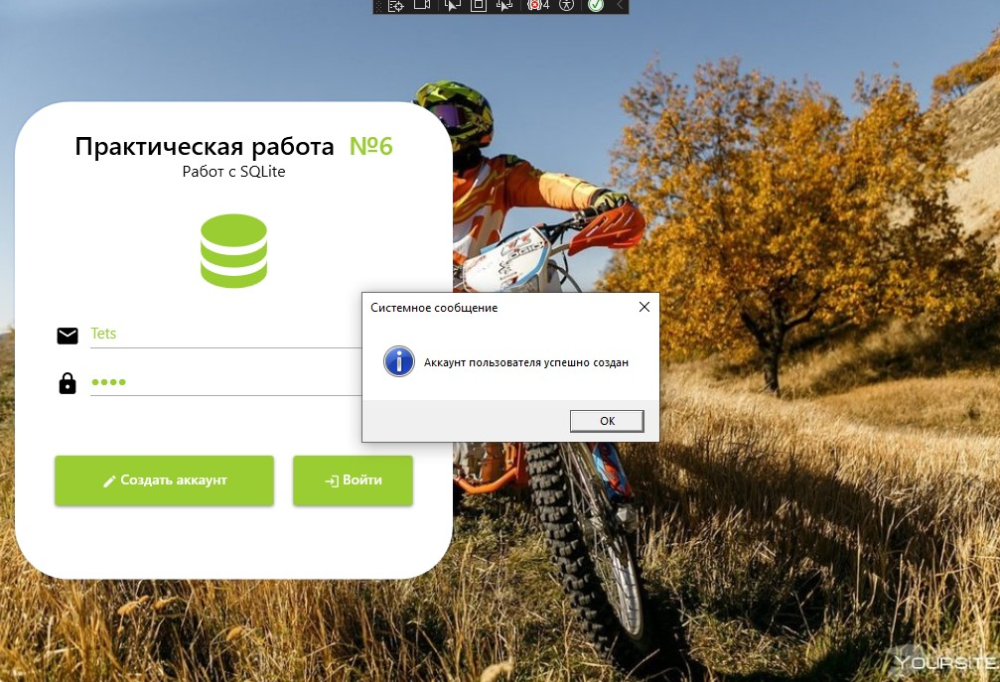
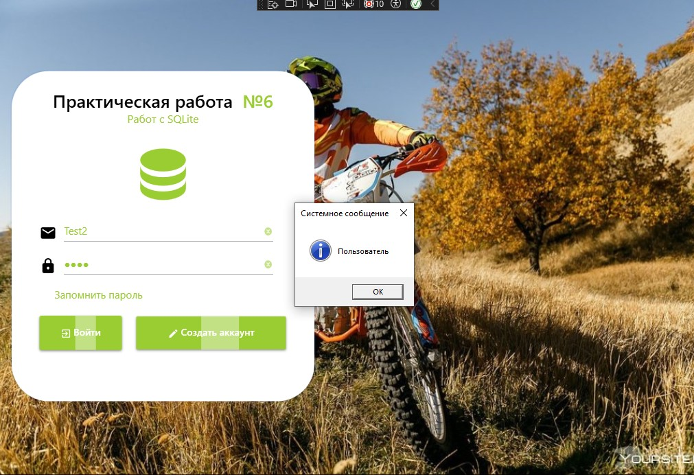

<h1>Задание 6. Использование EntityFrameworkCore и SQLite</h1>

<h3> Технологии проекта:</h3>
<ul>
  <li><b>Entity Framework Core</b> - для работы с базой данных</li>
  <li><b>SQLite</b> - в качестве легковесной СУБД</li>
</ul>

<h3> Основной функционал:</h3>
<ul>
  <li>Регистрация новых пользователей</li>
  <li>Авторизация в системе</li>
  <li>Управление ролями пользователей</li>
</ul>

<h3> Запуск приложения:</h3>
<ol>
  <li>Запустить исполняемый файл: <code>Task6SQLite.exe</code></li>
</ol>

<h3> Скриншоты интерфейса:</h3>

  
  

